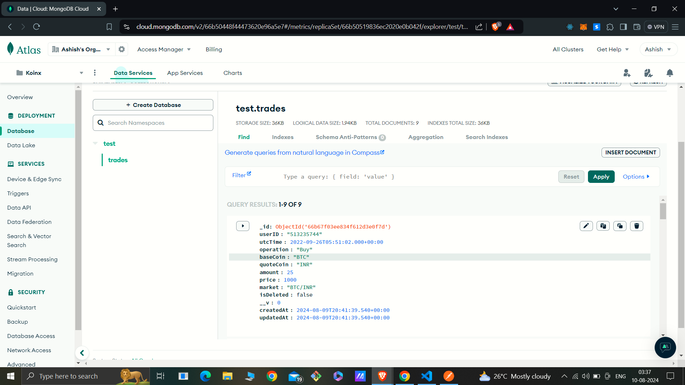
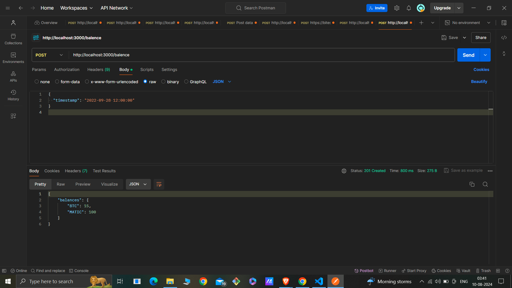

# KoinX Asset Balance API

This project is an API service that calculates the asset-wise balance of an account at any given timestamp. The API uses a MongoDB database to store transaction data and allows users to query the balance of various assets (such as BTC, MATIC, etc.) at specific timestamps.

## Features

- **Asset Balance Calculation**: Retrieve the balance of assets like BTC, MATIC, etc., at any specified timestamp.
- **Mongoose Integration**: Uses Mongoose to connect to a MongoDB Atlas database.
- **CSV Data Import**: Import transaction data from CSV files into the MongoDB database.

## Prerequisites

- **Node.js**: Make sure you have Node.js installed (v14.x or later).
- **MongoDB Atlas**: This project uses a MongoDB Atlas cluster. Ensure you have a MongoDB Atlas account and cluster set up.

## Installation

1. **Clone the Repository**:

   ```bash
   git clone git@github.com:ashish07-07/KoinX.git
   cd Koinx
   ```

2. **Install Dependencies**:

   ```bash
   npm install
   ```

3. **Set Up Environment Variables**:
   Create a `.env` file in the root directory and add the following:

   ```env
   MONGODB_URI="your_mongodb_connection_string"
   ```

4. **Build the Project**:

   ```bash
   npm run build
   ```

5. **Run the Project**:

   ```bash
   npm start
   ```

## Usage

### API Endpoint

    

- **POST /api/balance**

  - Request:
    ```json
    {
      "timestamp": "2022-09-28 12:00:00"
    }
    ```
  - Response:

    ```json
    {
      "BTC": 15,
      "MATIC": 100
    }
    ```

    

### Example

Send a POST request to `http://localhost:3000/api/balance` with a JSON body containing a `timestamp` to get the balance of assets at that timestamp.



## Project Structure

- **src/**
  - `index.ts`: Entry point of the application.
  - `routes/`: Contains the API route handlers.
  - `db/schema.ts`: Defines the Mongoose schema for the transactions.
